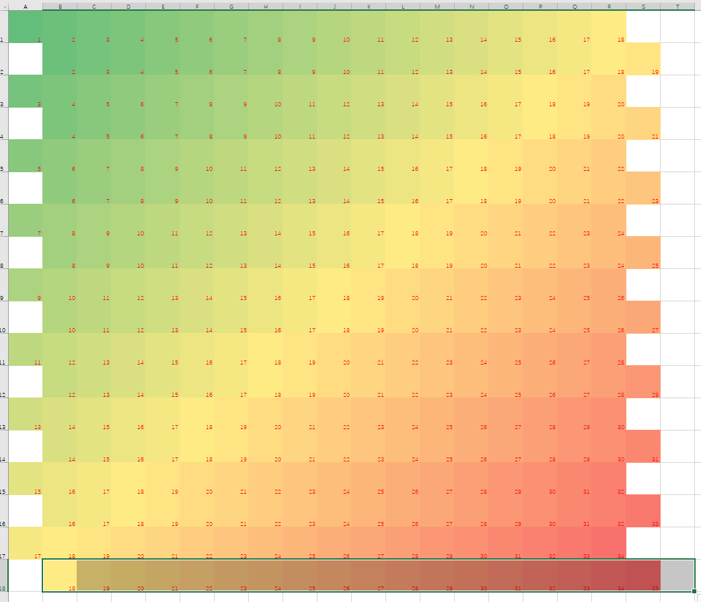
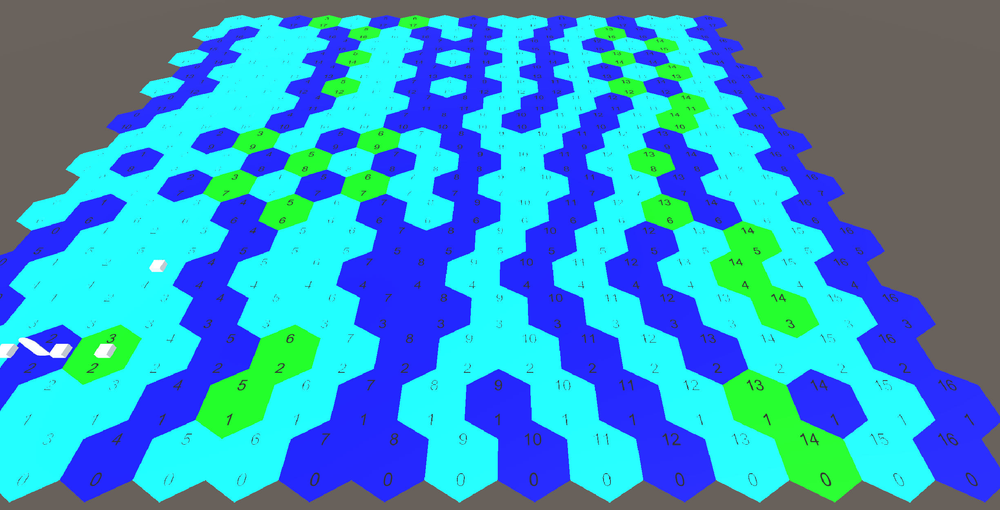

# 突击群 策划案
## 项目概述
设计师旅级别的作战编制，选择不同的战术偏好学说，进行旅团级的小规模突破作战，以小见大，最终影响整场战役的胜败。
### 细节描述
#### 1.设计作战编制

类似钢铁雄心4编制设定，对一个师进行编制设计，简化为步兵部队、装甲部队、火力支援部队，基本编制均为营。设计由数个营部组成的旅部，再由旅部组成师部，类似：

第1步兵师 
|-11步兵旅 
| |-111步兵营  
| |-112步兵营 
| |-113步兵营 
| |-114炮兵营 
| |-115装甲营 
|-12步兵旅 
| |-121步兵营 
| |-122步兵营 
| |-123步兵营 
| |-124炮兵营 
| |-125装甲营  
|-13装甲旅 
| |-131步兵营 
| |-132装甲营 
| |-133装甲营 
| |-134炮兵营 
| |-135防空营 

其中：

步兵部队：提供基本的进攻数值，中等的防御数值，主要的组织度，低廉的造价。

装甲部队：提供主要的进攻数值，中等的防御数值，基本的组织度，高昂的造价(可能)。

火力支援部队：分为前线火力与支援火力，提供中等的进攻数值，中等的防御数值，不提供组织度，中等的造价。

对于设计部队来说，需要满足营的数量要求，合适的面板属性，适当的造价。

面板数值：量化数值，作为影响战局的参数。
### 2.战术偏好学说
#### a. 宽大战线作战
强调以整个师团作为整体对战线发动突破，重点强化部队的面板属性。在战术战斗中，将更平均的使用兵力，并强化自动战斗的能力。
#### b.集中突破计划
强调将优势兵力集中到突击群，使用突击群进行局部战线的突破。在战术战斗中，将注重多兵种的协同进攻能力，并强化手动战斗对整个战局的影响。
### 3.“突击群”级突破作战

采取战棋类操作，战场尺度1.08km\*1.08km，时间跨度1h，最小单元60m\*60m，时间速率可为1x-12x 
战场格子如图: 
 
其中最小的一个单位为**一个步兵班**或者**一辆装甲单位**或者**一个炮组**。 
作战目的一般为**进攻突破任务**或者**弹性防御任务**，其核心目的是突破敌方防线，并使敌人在有限时间内无法重新夺回，任务过程中尽可能多地歼灭敌人有生力量，尽可能少地损失己方兵力，**歼灭数量**与**损失数量**将会不同程度得影响最终战局。
