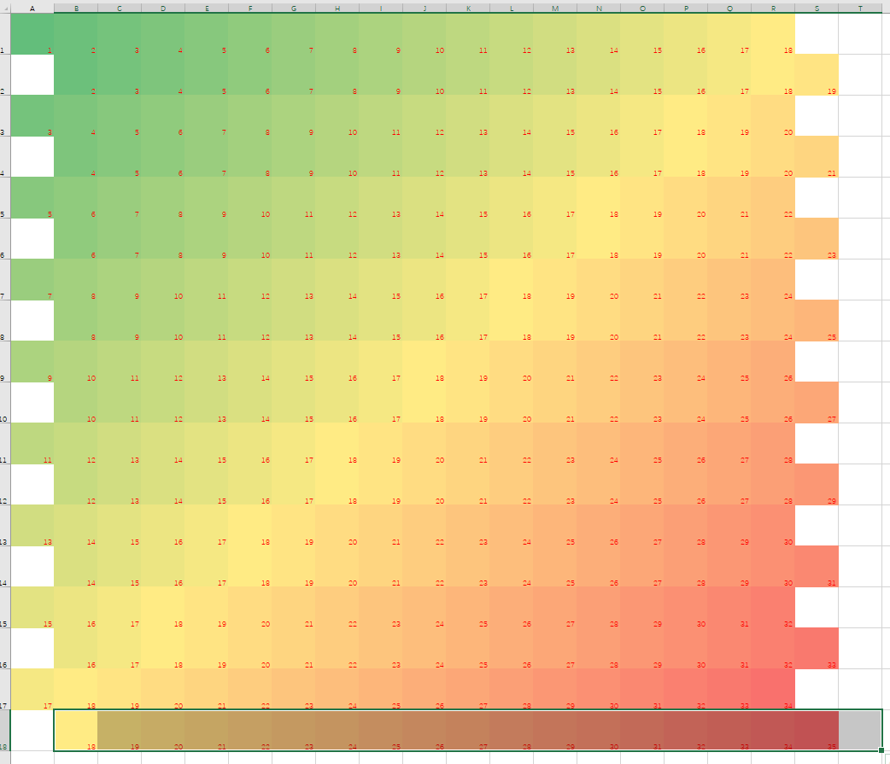
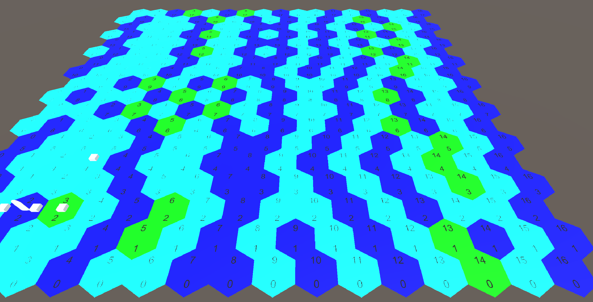

# 突击群 策划案
## 项目概述
设计师旅级别的作战编制，选择不同的战术偏好学说，进行旅团级的小规模突破作战，以小见大，最终影响整场战役的胜败。
### 细节描述
#### 游戏流程
- 选择偏好战术   <------|
- 设计作战编制   <------|
- 将部队投入前线        |
- 战役阶段              |
    - 战役推进 <-|      |    
    - 战术行动   |      |
    - 战斗结算 >-|      |
- 战役结算      >-------|
#### 1. 设计作战编制

类似钢铁雄心4编制设定，对一个师进行编制设计，简化为步兵部队、装甲部队、火力支援部队，基本编制均为营。设计由数个营部组成的旅部，再由旅部组成师部，类似：

第1步兵师 
|-11步兵旅 
| |-111步兵营 
| |-112步兵营 
| |-113步兵营 
| |-114炮兵营 
| |-115装甲营 
|-12步兵旅 
| |-121步兵营  
| |-122步兵营  
| |-123步兵营  
| |-124炮兵营  
| |-125装甲营   
|-13装甲旅  
| |-131步兵营  
| |-132装甲营  
| |-133装甲营  
| |-134炮兵营  
| |-135防空营  

其中：

步兵部队：提供基本的进攻数值，中等的防御数值，主要的组织度，低廉的造价。

装甲部队：提供主要的进攻数值，中等的防御数值，基本的组织度，高昂的造价(可能)。

火力支援部队：分为前线火力与支援火力，提供中等的进攻数值，中等的防御数值，不提供组织度，中等的造价。

对于设计部队来说，需要满足营的数量要求，合适的面板属性，适当的造价。

面板数值：量化数值，作为影响战局的参数。
#### 2.战术偏好学说
##### a. 宽大战线作战
强调以整个师团作为整体对战线发动突破，重点强化部队的面板属性。在战术战斗中，将更平均的使用兵力，并强化自动战斗的能力。
科技树： 
- ……
##### b.集中突破计划
强调将优势兵力集中到突击群，使用突击群进行局部战线的突破。在战术战斗中，将注重多兵种的协同进攻能力，并强化手动战斗对整个战局的影响。
科技树： 
- ……
#### 3.“突击群”级突破作战

采取战棋类操作，战场尺度1.08km\*1.08km，时间跨度1h，最小单元60m\*60m，对应即为18\*18的格子，时间速率可为1x-12x 
战场格子如图: 
 
其中最小的一个单位为**一个步兵班**或者**一辆装甲单位**或者**一个炮组**。 
作战目的一般为**进攻突破任务**或者**弹性防御任务**，其核心目的是突破敌方防线，并使敌人在有限时间内无法重新夺回，任务过程中尽可能多地歼灭敌人有生力量，尽可能少地损失己方兵力，**歼灭数量**与**损失数量**将会不同程度得影响最终战局。

### 游戏场景需求
1. 科技树选择界面
    - ……
2. 部队编成界面  
    如图   
3. 战术战棋界面  
    - 摄像机可以有**升降**、**上下左右平移**、**视角旋转**等几个自由度。 
    - 每一个棋子可以通过**选择最终移动位置**的方式进行移动。
        - 当单位是**一个步兵班**时，可以以任意方向移动，单位视野为半径**5格**，单位会警戒半径**4格**，会主动攻击半径**2格子**的非装甲单位。
        - 当单位是**一个装甲单位**时，可以选择任意方向移动，车体会指向目标方向，同时需要选择炮塔指向，单位视野为炮塔指向方向以及周围两格的、半径为**6格**的扇形区域，以及车体前方的**4格**，，单位会*警戒*半径**4格**，当触发*警戒*时，会试图将炮塔指向目标并攻击目标。如图是一个装甲单位移动三次的示意图，红色部分为炮塔警戒范围，绿色部分为驾驶员视野部分
        - 当单位是**一个炮组**时，只能向视野内的一个方向移动，其视野与装甲单位炮塔视野类似，部署与移动均需要花费时间，且移动过程中无警戒能力，不可以移动中开火。
    - 选中单位后应当显示其视野范围等信息。
    - 在该界面中，具备调节时间流速的控制组件。
    - 根据单位视野拥有战争迷雾机制。
    - 统计信息与结算组件。
    - ……
3. 战役阶段界面
    **应显示：**  
    - 战术行动方向
    - 部队状态
    - 历史战斗信息
